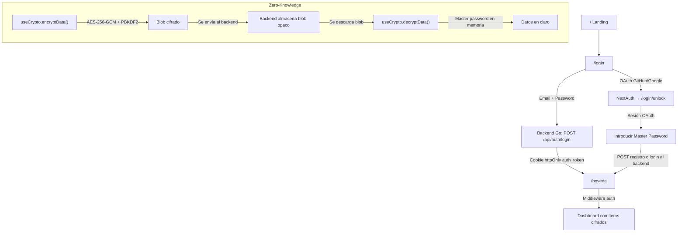

# 🔒 Alcatraz

**Gestor de contraseñas y notas cifradas** con arquitectura **zero-knowledge**. Construido con **Nuxt 4**, backend **Go** y cifrado **AES-256-GCM** del lado del cliente.

> El servidor **nunca** ve tus datos en texto plano. Todo se cifra/descifra en el navegador con tu contraseña maestra.

---

## Stack tecnológico

| Capa | Tecnología |
|------|-----------|
| **Frontend** | Nuxt 4.2 · Vue 3.5 · TypeScript |
| **UI** | @nuxt/ui 4.3 · Tailwind CSS 4.1 |
| **Auth** | @sidebase/nuxt-auth (NextAuth) · OAuth (GitHub, Google) |
| **Criptografía** | Web Crypto API · AES-256-GCM · PBKDF2 (100 000 iteraciones) |
| **Backend** | Go (API REST separada) |
| **Validación** | Zod 4 |
| **Tipografía** | @nuxt/fonts (Instrument Sans, DM Sans) |
| **Linting** | oxlint |

---

## Arquitectura del proyecto

```text
Alcatraz/
├── app/
│   ├── app.vue                   # Entry point (fuerza dark mode)
│   ├── assets/css/main.css       # Design system global
│   ├── components/
│   │   ├── AuthHeader.vue        # Header para vistas de auth
│   │   ├── SecurityCard.vue      # Card de la landing
│   │   ├── Footer.vue            # Footer global (4 columnas)
│   │   └── vault/forms/          # Formularios de la bóveda
│   │       ├── TypeSelector.vue  # Selector de tipo de ítem
│   │       ├── FormLayout.vue    # Layout compartido para forms
│   │       ├── PasswordForm.vue  # Formulario de contraseñas
│   │       ├── NoteForm.vue      # Formulario de notas
│   │       ├── CardForm.vue      # Formulario de tarjetas
│   │       └── IdentityForm.vue  # Formulario de identidades
│   ├── composables/
│   │   ├── useAuthForm.ts        # Lógica del formulario de login
│   │   ├── useRegisterForm.ts    # Lógica del formulario de registro
│   │   ├── useCrypto.ts          # Cifrado/descifrado AES-256-GCM
│   │   ├── useVault.ts           # CRUD de ítems de la bóveda
│   │   ├── useMasterPassword.ts  # Estado en memoria de la master password
│   │   └── useUser.ts            # Datos del usuario autenticado
│   ├── layouts/
│   │   ├── default.vue           # Layout público (header + footer)
│   │   └── vault.vue             # Layout de la bóveda (sin header)
│   ├── middleware/
│   │   ├── auth.ts               # Protege rutas → redirige a /login
│   │   └── guest.ts              # Protege rutas de invitado → redirige a /boveda
│   ├── pages/
│   │   ├── index.vue             # Landing page
│   │   ├── login/
│   │   │   ├── index.vue         # Login (email/pass + OAuth)
│   │   │   └── unlock/index.vue  # Desbloqueo con master password (post-OAuth)
│   │   ├── register/index.vue    # Registro de usuario
│   │   ├── pricing/index.vue     # Planes y precios
│   │   └── boveda/
│   │       ├── index.vue         # Dashboard principal de la bóveda
│   │       ├── new.vue           # Crear nuevo ítem
│   │       ├── [id].vue          # Ver/editar un ítem
│   │       └── perfil.vue        # Perfil del usuario
│   └── types/
│       └── vault.ts              # Tipos TypeScript de la bóveda
├── server/
│   └── api/auth/
│       ├── [...].ts              # NuxtAuthHandler (GitHub + Google OAuth)
│       ├── check.get.ts          # Comprueba si hay cookie auth_token
│       └── me.get.ts             # Decodifica JWT → devuelve email
├── public/
│   ├── favicon.ico
│   ├── images/                   # Assets estáticos
│   └── robots.txt
├── nuxt.config.ts                # Configuración de módulos y runtime
├── package.json
├── tsconfig.json
├── .env                          # Variables de entorno (NO commitear)
└── .oxlintrc.json                # Configuración de oxlint
```

---

## Flujo de autenticación



### Flujo resumido

1. **Login**: El usuario puede entrar con email/password (backend Go) o con OAuth (GitHub/Google).
2. **Master Password**: Tras OAuth, el usuario introduce su contraseña maestra en `/login/unlock`.
3. **Cookie**: El backend Go establece una cookie `httpOnly` con un JWT (`auth_token`).
4. **Protección de rutas**: El middleware `auth.ts` verifica la cookie en cada navegación a `/boveda`.
5. **Zero-knowledge**: Los datos sensibles se cifran en el navegador con `useCrypto` antes de enviarse al backend. El servidor solo ve blobs cifrados.

---

## Tipos de ítems de la bóveda

| Tipo | Campos sensibles |
|------|-----------------|
| `password` | `username`, `password`, `url` |
| `note` | `note` |
| `card` | `holder`, `number`, `expiry`, `cvv` |
| `identity` | `firstName`, `lastName`, `email`, `phone`, `address`, etc. |

Cada ítem se serializa como JSON, se cifra con AES-256-GCM (salt + iv aleatorios) y se almacena como `{ encrypted_data, iv, salt }`.

---

## Requisitos del sistema

- **Node.js** 18+ (recomendado 18.18+)
- **pnpm** 10 (principal) — también compatible con npm/yarn/bun
- **Backend Go** corriendo en `http://localhost:8080` (configurable vía `NUXT_PUBLIC_API_BASE`)
- Navegador moderno (Chrome, Firefox, Edge, Safari)

---

## Instalación

```bash
# Clonar
git clone <url-del-repo>
cd Alcatraz

# Instalar dependencias
pnpm install

# Configurar variables de entorno
cp .env.example .env
# Editar .env con tus credenciales de OAuth y secret
```

### Variables de entorno requeridas

| Variable | Descripción |
|----------|------------|
| `NUXT_SECRET` | Secret para NextAuth (sesiones) |
| `NUXT_AUTH_BASE_URL` | URL base de la API de auth |
| `NUXT_AUTH_GITHUB_CLIENT_ID` | Client ID de GitHub OAuth |
| `NUXT_AUTH_GITHUB_CLIENT_SECRET` | Client Secret de GitHub OAuth |
| `NUXT_AUTH_GOOGLE_CLIENT_ID` | Client ID de Google OAuth |
| `NUXT_AUTH_GOOGLE_CLIENT_SECRET` | Client Secret de Google OAuth |
| `NUXT_PUBLIC_API_BASE` | URL del backend Go (default: `http://localhost:8080`) |

> ⚠️ **Nunca subas `.env` al repositorio.** Está en `.gitignore`.

---

## Desarrollo

```bash
# Arrancar el servidor de desarrollo (http://localhost:3000)
pnpm dev

# Linting
pnpm lint
pnpm lint:fix

# Build de producción
pnpm build
pnpm preview
```

> **`postinstall`** ejecuta `nuxt prepare` automáticamente para generar tipos en `.nuxt`.

---

## Design system

Los estilos globales están en `app/assets/css/main.css` e incluyen:

- **Color tokens**: `--accent` (emerald), `--surface-0..3`, `--border-*`
- **Tipografía**: `Instrument Sans` (headings) + `DM Sans` (body) vía `@nuxt/fonts`
- **Componentes CSS**: `.btn`, `.btn-accent`, `.btn-ghost`, `.landing-card`, `.hero-glow`, `.cta-section`
- **Animaciones**: `fadeUp`, delays escalonados (`animate-delay-100..600`)
- **Accesibilidad**: focus-visible con ring en todos los interactivos

---

## Rutas de la aplicación

| Ruta | Middleware | Layout | Descripción |
|------|-----------|--------|------------|
| `/` | — | default | Landing page |
| `/login` | guest | default | Login (email/pass + OAuth) |
| `/login/unlock` | — | default | Master password post-OAuth |
| `/register` | — | default | Registro de usuario |
| `/pricing` | — | default | Planes y precios |
| `/boveda` | auth | vault | Dashboard de la bóveda |
| `/boveda/new` | auth | — | Crear nuevo ítem |
| `/boveda/[id]` | auth | — | Ver/editar un ítem |
| `/boveda/perfil` | auth | vault | Perfil y seguridad |

---

## Convenciones del proyecto

- Usa `NuxtLink` / `ULink` para navegación interna.
- Prefiere tokens de `@nuxt/ui` y variables CSS del design system.
- Componentes en `app/components/`, composables en `app/composables/`.
- Los composables encapsulan toda la lógica de negocio; las páginas solo consumen.
- La master password **nunca** se persiste en disco ni `localStorage` — solo `useState` en memoria.
- Los datos sensibles se cifran **antes** de salir del navegador.

---

## Troubleshooting

| Problema | Solución |
|----------|---------|
| Errores de tipos / auto-imports | `pnpm run postinstall` o `nuxt prepare` |
| Estilos no aplican | Verificar `css` en `nuxt.config.ts` |
| OAuth no funciona | Verificar variables `NUXT_AUTH_*` en `.env` |
| 401 en la bóveda | Verificar que el backend Go esté corriendo y que la cookie `auth_token` se esté estableciendo como `httpOnly` |
| Iconos no aparecen | Confirmar `@nuxt/ui` activo en `nuxt.config.ts` |

---

## Licencia

MIT — consulta el archivo `LICENSE` para detalles.
