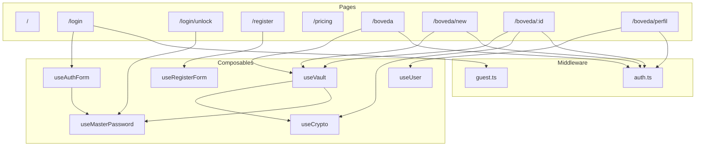

# app/

Capa de interfaz de Alcatraz. Contiene páginas, componentes, composables, middleware, layouts y tipos que conforman la aplicación Nuxt 4.

## Estructura

```text
app/
├── app.vue                   # Entry point — fuerza dark mode
├── assets/css/main.css       # Design system global
├── components/               # Componentes reutilizables
│   ├── AuthHeader.vue
│   ├── SecurityCard.vue
│   ├── Footer.vue
│   └── vault/forms/          # Formularios del vault (6)
├── composables/              # Lógica de negocio (6)
├── layouts/                  # default + vault
├── middleware/               # auth + guest
├── pages/                    # Todas las vistas
└── types/                    # Tipos TypeScript
```

## Dependencias clave

| Paquete | Uso |
|---------|-----|
| `@nuxt/ui` | Componentes UI: `UAuthForm`, `UDashboardGroup`, `UCard`, `UPricingPlans`... |
| `zod` | Validación de formularios (login, registro) |
| `@sidebase/nuxt-auth` | Integración con NextAuth para OAuth |
| `@nuxt/fonts` | Carga automática de Instrument Sans / DM Sans |
| `@nuxt/image` | Optimización de imágenes |

## app.vue

Entry point de la aplicación. Fuerza el modo oscuro y renderiza `<NuxtLayout>` + `<NuxtPage>`.

```vue
<script setup>
const colorMode = useColorMode()
colorMode.preference = 'dark'
</script>
<template>
  <NuxtLayout><NuxtPage /></NuxtLayout>
</template>
```

## Design system (main.css)

El archivo `assets/css/main.css` define un sistema de diseño completo:

- **Colores**: paleta basada en `--accent: 160 84% 55%` (emerald), superficies `--surface-0..3`
- **Tipografía**: Instrument Sans (headings) + DM Sans (body)
- **Componentes**: `.btn`, `.btn-accent`, `.btn-ghost`, `.landing-card`, `.stat-card`
- **Efectos**: `.hero-glow`, `.hero-mockup-frame`, `.cta-section`
- **Animaciones**: `@keyframes fadeUp`, clases `.animate-fade-up`, `.animate-delay-*`
- **Accesibilidad**: `:focus-visible` con ring blanco en todos los interactivos

## Diagrama de dependencias


```mermaid
flowchart TD
    subgraph Pages
        LND["/"]
        LOG["/login"]
        UNL["/login/unlock"]
        REG["/register"]
        PRC["/pricing"]
        BOV["/boveda"]
        NEW["/boveda/new"]
        DET["/boveda/:id"]
        PRF["/boveda/perfil"]
    end

    subgraph Composables
        AF[useAuthForm]
        RF[useRegisterForm]
        CR[useCrypto]
        VT[useVault]
        MP[useMasterPassword]
        US[useUser]
    end

    subgraph Middleware
        AU[auth.ts]
        GU[guest.ts]
    end

    LOG --> AF
    LOG --> GU
    UNL --> MP
    REG --> RF
    BOV --> VT
    BOV --> AU
    NEW --> VT
    NEW --> AU
    DET --> VT
    DET --> CR
    DET --> AU
    PRF --> US
    PRF --> AU
    AF --> MP
    VT --> CR
    VT --> MP
```

## Convenciones

- Los **composables** encapsulan toda la lógica de negocio; las **páginas** solo consumen.
- La `masterPassword` vive en `useState` (memoria) — nunca se persiste.
- Los datos sensibles se cifran **antes** de enviarse al backend.
- El layout `vault` se usa para rutas `/boveda`; el layout `default` muestra header + footer.
- Cada subdirectorio tiene su propio `README.md` con documentación detallada.
