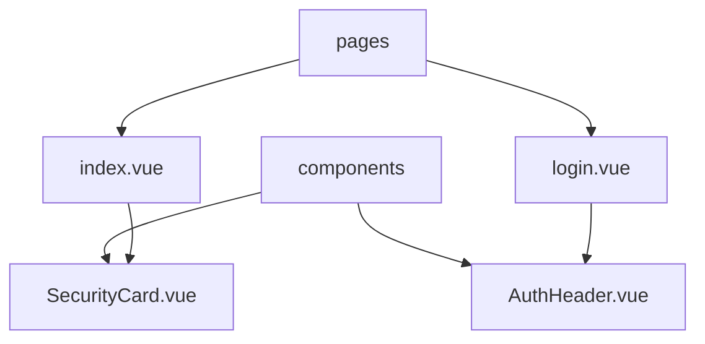

# app

Contiene la capa de interfaz (páginas y componentes) de la aplicación Nuxt. Aquí se definen vistas, layouts y componentes reutilizables que se integran con `@nuxt/ui` y estilos globales.

## Propósito

- Organizar la UI en `pages` y `components` siguiendo las convenciones de Nuxt 4.
- Centralizar el uso de componentes de `@nuxt/ui` y patrones de accesibilidad.

## Arquitectura

```text
app/
├─ pages/
│  ├─ index.vue
│  └─ login.vue
└─ components/
   ├─ AuthHeader.vue
   └─ SecurityCard.vue
```



## Dependencias específicas

- `@nuxt/ui`: set de componentes UI (Form, AuthForm, Card, Button, etc.).
- `zod`: validación de formularios.
- `tailwindcss`: utilidades de estilo; modo oscuro y tokens.

## Ejemplo avanzado: composición de `UAuthForm`

```vue
<script setup lang="ts">
import { ref } from 'vue'
import { z } from 'zod'
import type { AuthFormField, ButtonProps, FormSubmitEvent } from '@nuxt/ui'

const schema = z.object({
  email: z.string().email(),
  password: z.string().min(8),
  remember: z.boolean().optional()
})

const fields = ref<AuthFormField[]>([
  { name: 'email', type: 'email', label: 'Email' },
  { name: 'password', type: 'password', label: 'Contraseña' },
  { name: 'remember', type: 'checkbox', label: 'Recordar' }
])

const providers = ref<ButtonProps[]>([
  { label: 'Google', icon: 'i-logos-google-icon', color: 'neutral', variant: 'soft' },
  { label: 'GitHub', icon: 'i-logos-github-icon', color: 'neutral', variant: 'soft' }
])

function onSubmit(e: FormSubmitEvent<any>) {
  // Integración con tu API de auth
}
</script>

<template>
  <UAuthForm
    title="Acceder"
    :schema="schema"
    :fields="fields"
    :providers="providers"
    @submit="onSubmit"
  />
  
  <!-- Slots útiles -->
  <!-- #password-hint, #validation, #footer -->
</template>
```

## Consideraciones de implementación

- Mantén la validación alineada con los `name` de campos del formulario.
- Evita estilos en línea complejos; usa utilidades de Tailwind y la API de `ui` de Nuxt UI.
- Revisa accesibilidad: `aria-label`, contraste, foco visible.

## Troubleshooting

- Errores de tipos o auto-imports: ejecuta `nuxt prepare` o `pnpm run postinstall`.
- Estilos no aplican: revisa `nuxt.config.ts` para `css` y plugins de Tailwind.
- Eventos del formulario no disparan: confirma `@submit` en `UAuthForm` y que no haya colisiones con `state/validate` personalizados.