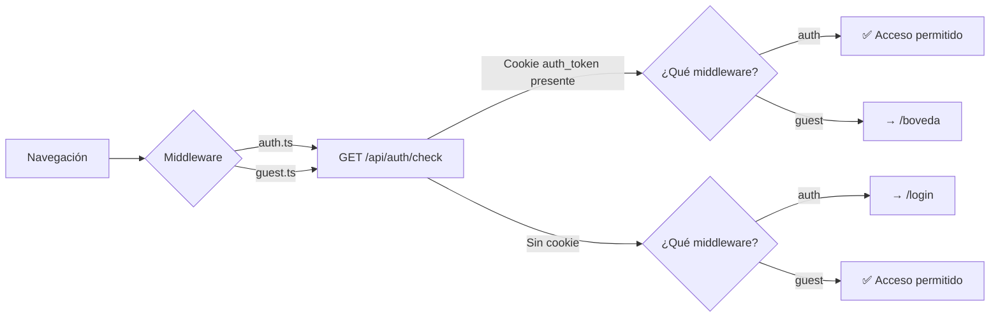

# app/middleware/

Middleware de navegación de Nuxt para control de acceso.

## Propósito

Proteger rutas según el estado de autenticación del usuario antes de que la página se renderice.

## Middleware disponible

### `auth.ts`

**Protege rutas que requieren autenticación.** Si el usuario no está autenticado, redirige a `/login`.

```ts
// Uso en una página:
definePageMeta({ middleware: 'auth' })
```

**Lógica:**
1. Hace `useFetch('/api/auth/check')` al servidor Nuxt
2. Si `data.authenticated === false` → `navigateTo('/login')`
3. Si hay cookie válida → permite el acceso

**Se usa en:** `/boveda`, `/boveda/new`, `/boveda/[id]`, `/boveda/perfil`

---

### `guest.ts`

**Protege rutas que solo deben ver usuarios NO autenticados.** Si el usuario ya está autenticado, redirige a `/boveda`.

```ts
// Uso en una página:
definePageMeta({ middleware: 'guest' })
```

**Lógica:**
1. Hace `useFetch('/api/auth/check')` al servidor Nuxt
2. Si `data.authenticated === true` → `navigateTo('/boveda')`
3. Si no hay cookie → permite el acceso

**Se usa en:** `/login`

---

## Flujo de verificación



## Notas

- Ambos middleware verifican la **presencia** de la cookie `auth_token`, no su contenido. La validación del JWT la hace el backend Go.
- Los middleware son `async` y usan `useFetch` (SSR-compatible).
