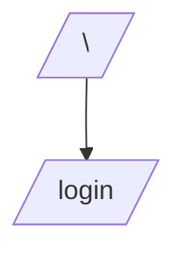

# app/pages

Contiene las páginas de la aplicación (`.vue`) que Nuxt enruta automáticamente según el nombre del archivo.

## Propósito

- Definir vistas de alto nivel (landing, login, etc.).
- Integrar componentes globales y estilos consistentes.

## Páginas incluidas

- `index.vue`: landing con cards y secciones informativas.
- `login.vue`: formulario de autenticación basado en `UAuthForm` + `zod`.

## Diagrama de navegación



## Dependencias específicas

- `@nuxt/ui`: `UContainer`, `UCard`, `UButton`, `UAuthForm`, `UAlert`, etc.
- `zod`: validación de formulario en `login.vue`.

## Ejemplo avanzado: personalización oscura del login

```vue
<template>
  <div class="min-h-screen bg-neutral-950 text-white grid place-items-center py-12">
    <UContainer>
      <UCard class="bg-black text-white border border-white/10">
        <UAuthForm
          title="Inicia sesión"
          :schema="schema"
          :fields="fields"
          :providers="providers"
          :submit="{ label: 'Acceder', class: 'bg-white text-black border border-white' }"
        />
      </UCard>
    </UContainer>
  </div>
</template>
```

## Consideraciones de implementación

- Evitar duplicación de lógica entre páginas; extrae componentes cuando sea necesario.
- Mantener contrastes altos para modo oscuro (`bg-neutral-950`, `text-white`).
- Usar slots de `UAuthForm` para enlaces y mensajes (e.g., `#password-hint`, `#footer`).

## Troubleshooting

- La navegación no funciona: confirma rutas y nombres de archivo en `pages`.
- Validaciones no aparecen: revisa que `schema` y `name` de los campos coincidan.
- Estilos no cargan: revisa `nuxt.config.ts` y `assets/css/main.css`.