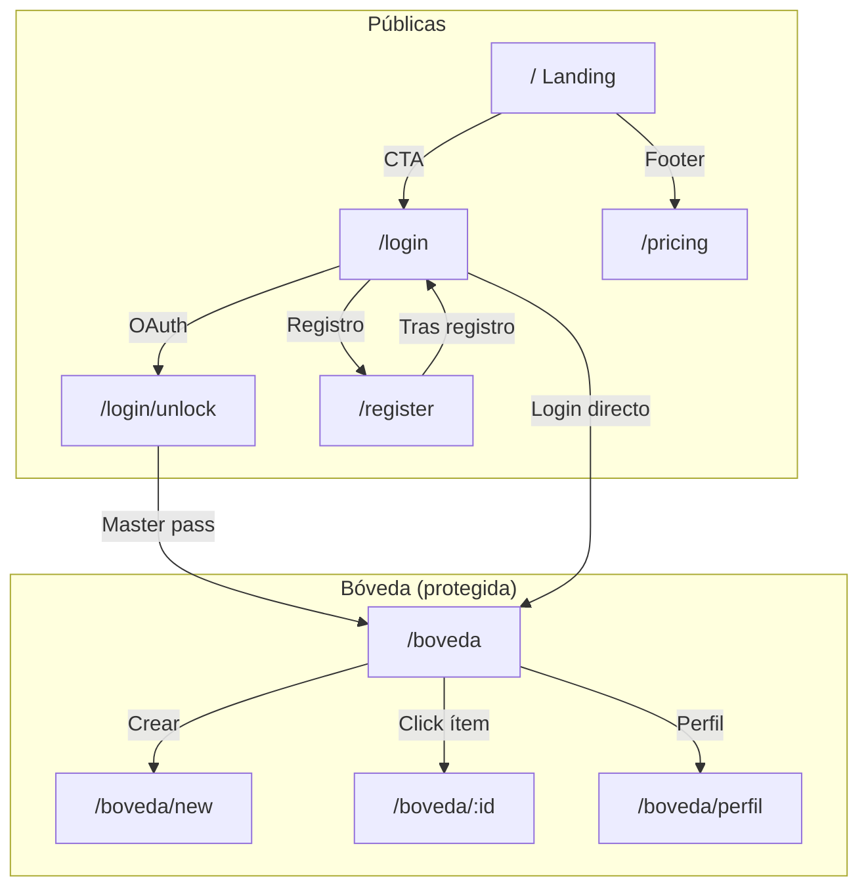

# app/pages/

Páginas de la aplicación. Nuxt genera las rutas automáticamente a partir de la estructura de archivos.

## Mapa de rutas

```mermaid
flowchart TD
    subgraph Públicas
        LP["/ Landing"]
        LG["/login"]
        UL["/login/unlock"]
        RG["/register"]
        PR["/pricing"]
    end

    subgraph Bóveda ["Bóveda (protegida)"]
        BV["/boveda"]
        NW["/boveda/new"]
        DT["/boveda/:id"]
        PF["/boveda/perfil"]
    end

    LP -->|CTA| LG
    LG -->|OAuth| UL
    LG -->|Registro| RG
    UL -->|Master pass| BV
    LG -->|Login directo| BV
    RG -->|Tras registro| LG
    BV -->|Crear| NW
    BV -->|Click ítem| DT
    BV -->|Perfil| PF
    LP -->|Footer| PR
```

## Páginas detalladas

### `index.vue` — Landing (`/`)

- **Layout:** default
- **Middleware:** —
- Landing page con secciones de características, seguridad, estadísticas y CTA
- Usa `SecurityCard`, `AuthHeader` y clases del design system

---

### `login/index.vue` — Login (`/login`)

- **Layout:** default
- **Middleware:** `guest` (redirige a `/boveda` si ya autenticado)
- Formulario `UAuthForm` con OAuth (Google, Apple, GitHub)
- Composable: `useAuthForm()`
- Glassmorphism: `.glass-card-dark`, burbujas animadas, backdrop blur
- SEO: `<title>Iniciar sesión</title>`, Open Graph tags

---

### `login/unlock/index.vue` — Master Password (`/login/unlock`)

- **Layout:** default
- **Middleware:** —
- Pantalla post-OAuth para introducir la contraseña maestra
- Dos modos: `login` (desbloquear) y `register` (crear bóveda) vía `?mode=register`
- Muestra el email de la sesión OAuth activa
- Si no hay sesión, redirige a `/login`
- Envía `POST /api/auth/login` o `/api/auth/register` al backend Go con el email OAuth + master password

---

### `register/index.vue` — Registro (`/register`)

- **Layout:** default
- **Middleware:** —
- Formulario `UAuthForm` con confirmación de contraseña
- Composable: `useRegisterForm()`
- Mismo estilo visual que login (glassmorphism, burbujas)

---

### `pricing/index.vue` — Precios (`/pricing`)

- **Layout:** default
- **Middleware:** —
- Tres planes: Solo (€10/mes), Pro (€20/mes), Empresarial (€59/usuario/mes)
- Usa `UPricingPlans` de `@nuxt/ui`
- Background con efectos blur radiales

---

### `boveda/index.vue` — Dashboard (`/boveda`)

- **Layout:** vault
- **Middleware:** `auth`
- Dashboard principal con:
  - **Sidebar** responsive (`UDashboardSidebar`, `UDashboardGroup`)
  - **Navegación** por categoría (Todos, Contraseñas, Notas, Tarjetas, Identidad, Papelera, Carpetas)
  - **Búsqueda** de ítems
  - **Lista de ítems** filtrada y clickable → navega a `/boveda/[id]`
- Sidebar persiste colapso en `localStorage` (`alcatraz:vault-sidebar-collapsed`)
- Responsive: sidebar overlay en móvil, fijo en desktop (≥1024px)

---

### `boveda/new.vue` — Crear ítem (`/boveda/new`)

- **Layout:** — (sin layout explícito)
- **Middleware:** `auth`
- Wizard de creación:
  1. `TypeSelector` → seleccionar tipo
  2. Formulario específico (`PasswordForm`, `NoteForm`, `CardForm`, `IdentityForm`)
- Lazy-load de componentes de formulario (`defineAsyncComponent`)
- Transiciones animadas entre pasos
- Opción "crear otro" para encadenar creaciones

---

### `boveda/[id].vue` — Detalle del ítem (`/boveda/:id`)

- **Layout:** — (sin layout explícito)
- **Middleware:** `auth`
- Vista detallada de un ítem con:
  - **Modo lectura:** card premium con glassmorphism, botones de copiar
  - **Modo edición:** formulario inline del tipo correspondiente
- Descifra el ítem completo al montarse (`getDecryptedItem`)
- Funciones de copiar al portapapeles con feedback visual
- Vista diferente según tipo (password con show/hide, card con formato bancario, etc.)

---

### `boveda/perfil.vue` — Perfil (`/boveda/perfil`)

- **Layout:** vault
- **Middleware:** `auth`
- Secciones:
  - **Avatar** generado (initials + color por hash de email)
  - **Cuenta:** email (no modificable), cambiar contraseña
  - **Seguridad:** 2FA toggle, sesiones activas
  - **Zona de peligro:** cerrar sesión, eliminar cuenta
- Composable: `useUser()` para datos del perfil

---

## Patrones comunes

- Todas las páginas de auth (login, register, unlock) comparten el mismo estilo visual: `.glass-card-dark`, `.login-bg`, bubbles animadas
- Las páginas de la bóveda usan fondo `.vault-bg` con gradientes sutiles
- SEO configurado con `useHead()` en cada página (title, description, og:tags)
