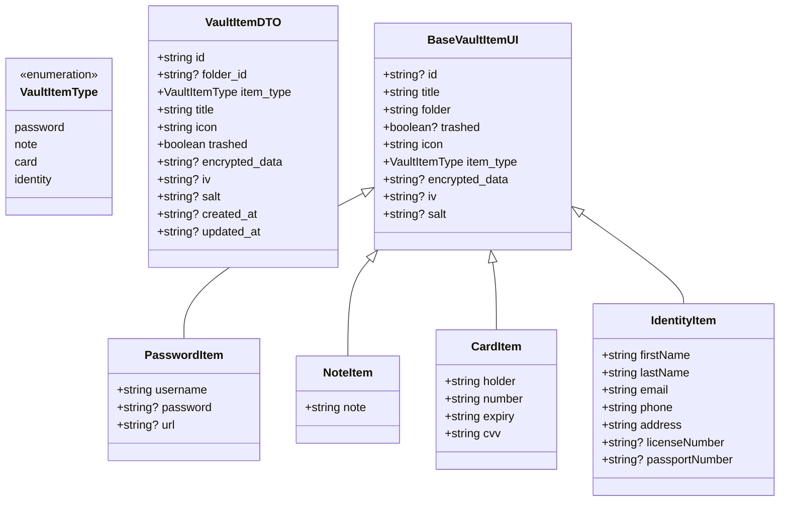

# app/types/

Tipos TypeScript para la bóveda de Alcatraz.

## `vault.ts`

Define la estructura de datos de los ítems de la bóveda, tanto en formato DTO (backend) como en formato UI (frontend descifrado).

### Tipos principales



### `VaultItemType`

```ts
type VaultItemType = 'password' | 'note' | 'card' | 'identity'
```

### `VaultItemDTO` (datos del backend)

Interfaz tal como viene del backend con campos en `snake_case` y datos cifrados opcionales.

### `BaseVaultItemUI` (interfaz base de UI)

Campos comunes a todos los tipos de ítems cuando se trabajan en el frontend.

### Tipos específicos

| Tipo | Campos exclusivos |
|------|------------------|
| `PasswordItem` | `username`, `password?`, `url?` |
| `NoteItem` | `note` |
| `CardItem` | `holder`, `number`, `expiry`, `cvv` |
| `IdentityItem` | `firstName`, `lastName`, `email`, `phone`, `address`, `licenseNumber?`, `passportNumber?` |

### Union type

```ts
type VaultItem = PasswordItem | NoteItem | CardItem | IdentityItem
```

Este es el tipo principal que se usa en toda la aplicación para representar cualquier ítem de la bóveda.

## Notas

- Los campos `encrypted_data`, `iv`, `salt` están presentes en ítems que aún no se han descifrado.
- Al descifrar (con `useCrypto`), se rellenan los campos específicos del tipo (password, note, etc.) y se eliminan los campos cifrados.
- El campo `id` es opcional al crear (el backend asigna un UUID) y obligatorio al recibir.
